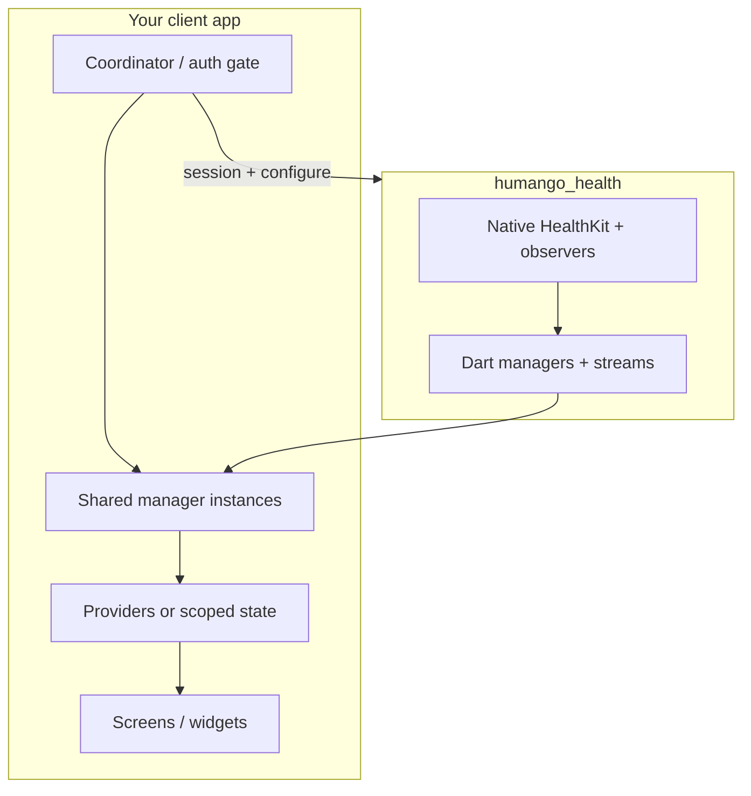

# Client app integration guide (consolidated)

Use this guide when wiring **any** Flutter host app to **`humango_health`** so it matches the same patterns as the plugin example app. It consolidates the [client integration contract](client_integration_contract.md) into actionable structure and steps.

| Document | Use when |
|----------|----------|
| **This guide** | Implementing or reviewing **your app’s** coordinator, providers, and subscriptions |
| [client_integration_contract.md](client_integration_contract.md) | Semantics, envelopes, ordering, success criteria, and library vs client responsibilities |
| Subsystem docs (`activity_reading.md`, `sleep_data.md`, …) | Payloads and APIs **per domain** |

**Reference implementation (canonical in this repo):** [`example/lib/health_sync_coordinator.dart`](../example/lib/health_sync_coordinator.dart) and tabs under [`example/lib/`](../example/lib/).

---

## 1. What you are building

- **`humango_health`** reads HealthKit on the device and **pushes** updates via streams and local queues. Workout and sleep **session** payloads are not POSTed by the plugin; your app uploads them.
- **Your app** supplies **when** configuration runs (after login / token), **one subscription per domain**, and **narrow UI updates**.

---

## 2. Non‑negotiables (same in every client)

1. **Single orchestration for background delivery**  
   One module (e.g. `HealthSyncCoordinator`) calls:
   - `UserSessionManager.setUserLoggedIn` when your user session changes  
   - `WorkoutReadManager.configureBackgroundDelivery` (workouts — arms stream/pending only, no native HTTP)  
   - `SleepDataManager.configureSleepBackgroundDelivery` (sleep)  
   after **auth (and athlete/user id)** is available.  
   Do **not** scatter these calls across unrelated widgets or routes.

2. **Idempotent configure**  
   Safe to call again after **token refresh** or app resume: native code skips no-op writes when the armed state is unchanged.

3. **One stable subscription per domain**  
   For each stream (`workoutStream`, `permissionStream`, `hrvUpdates`, …): one listener per manager instance, **cancel** in `dispose` / when turning monitoring off. Avoid multiple listeners that each fire the same side effects.

4. **No timer‑based sync as primary path**  
   Do not poll the library on an interval for data that observers already deliver. Use **explicit** one-shot APIs for catch-up (`readWorkouts`, `getSleepData`, `refreshSince`, etc.) on login, pull-to-refresh, or cold start—not a repeating background timer.

5. **Foreground streams vs local queues**  
   **Workouts:** `workoutStream` + optional UserDefaults pending JSON. **Sleep:** finalized sessions in `UserDefaults`; drain with `getLocalSleepSessions()` and upload from your app.

### Background uploads: your backend

The plugin does **not** POST workout or sleep session JSON. While the app is **suspended**, uploading those payloads requires **native iOS** (e.g. Runner `URLSession` background tasks) or waiting until the app runs again—not Dart `http` alone.

| Approach | Who calls your API | Coordinator |
|----------|-------------------|-------------|
| **Workouts** | Your app (Dart when foreground, or Runner native) | Coordinator arms delivery; you consume stream / pending JSON. |
| **Sleep** | Your app (same) | Coordinator calls `configureSleepBackgroundDelivery`; you drain `getLocalSleepSessions()`. |
| **Runner Swift + background `URLSession`** | Your native code | Session + `configure*`; your code owns HTTP. |

The coordinator **orchestrates** (session, idempotent configure, shared managers); it does **not** replace your networking layer.

---

## 3. Recommended app structure

| Piece | Responsibility |
|--------|----------------|
| **Coordinator** (`ChangeNotifier`, Riverpod notifier, or app service) | Session; calls `configureBackgroundDelivery` + `configureSleepBackgroundDelivery` once per logical “config needed” event (login, token refresh). Holds or exposes **singleton** `WorkoutReadManager` / `SleepDataManager` if you want one native channel pairing per process. |
| **Auth / credentials** | When login completes (or token updates), invoke coordinator: `setLoggedIn` + `ensureBackgroundDeliveryConfigured` (names may differ). |
| **Feature screens** | Call `startMonitoring` / `readWorkouts` / `getSleepData` as needed; **subscribe** to streams using managers from coordinator (or injected dependency). **Do not** call `configureBackgroundDelivery` from each tab. |
| **State** | Parse events; update incremental models; `notifyListeners` / `setState` only when data actually changes. |
| **UI** | Prefer **`Selector`** / **`Consumer`** with a narrow `select:` (Provider) or **`select`** (Riverpod) so unrelated health updates do not rebuild large trees (e.g. a full metrics tab). |

---

## 4. Implementation checklist

### Bootstrap

- [ ] Add `humango_health` dependency (version or Git `ref:`); see [contract doc § Local development](client_integration_contract.md#local-development-against-unpublished-library-changes) for `path:` / overrides during plugin development.
- [ ] Register your **coordinator** above the UI that needs health (e.g. next to global `Provider`s).

### Session (login / logout)

- [ ] On **login** (user id + token available): `UserSessionManager.setUserLoggedIn(true, userId: …)`.
- [ ] On **logout**: `setUserLoggedIn(false)` so native observers and stored delivery config follow the plugin’s session rules ([README § User Session](../README.md#user-session-management)).
- [ ] Immediately after login (or on same pipeline): run **background delivery configuration** (next section).

### Background delivery (one place)

- [ ] **Workouts:** `configureBackgroundDelivery(const BackgroundDeliveryConfig())` — arms stream/pending; upload from your app.
- [ ] **Sleep:** `configureSleepBackgroundDelivery(SleepBackgroundDeliveryConfig(...))` — mode `api` with `apiURL` and optional `headers`, or `localStorage` per product.
- [ ] On **token refresh**, call the same configure methods again with **new headers**; rely on idempotent native behavior for unchanged fields.

### Per domain

- [ ] **Permissions:** one `PermissionManager.permissionStream` subscription at app or shell level; expose to UI via provider.
- [ ] **Workout read:** one `WorkoutReadManager` (from coordinator), `workoutStream` subscription only while monitoring; cancel on stop; use one-shot `readWorkouts` for catch-up.
- [ ] **Sleep:** one `SleepDataManager`; foreground monitoring vs one-shot `getSleepData` per subsystem docs; no duplicate `configureSleepBackgroundDelivery` from feature widgets.
- [ ] **HRV / metrics:** one `hrvUpdates` subscription when HRV monitoring is active; do not stack duplicate listeners in `initState` and toggle handlers (see [example `health_metrics_screen.dart`](../example/lib/health_metrics_screen.dart)).

### UI performance

- [ ] Replace broad `Consumer`/`context.watch` with **`Selector`** / narrow **`select`** where lists or heavy subtrees depend on health state.
- [ ] Optional: document recommended **event envelope** shape in your app when parsing maps from streams ([contract § Event envelope](client_integration_contract.md#event-envelope-recommended)).

### Testing (client)

- [ ] Mock stream emissions; assert provider/state updates.
- [ ] Optionally: integration test configure → emit → state.

---

## 5. Porting from the plugin example

The example app is the **literal** template:

| Concern | File |
|---------|------|
| Coordinator + shared managers + configure | [`example/lib/health_sync_coordinator.dart`](../example/lib/health_sync_coordinator.dart) |
| Permissions + `Selector` | [`example/lib/main.dart`](../example/lib/main.dart) |
| Read tab: stream only, no configure in screen | [`example/lib/workout_read_screen.dart`](../example/lib/workout_read_screen.dart) |
| Sleep: session + config via coordinator | [`example/lib/sleep_data_screen.dart`](../example/lib/sleep_data_screen.dart) |
| HRV: single subscription path | [`example/lib/health_metrics_screen.dart`](../example/lib/health_metrics_screen.dart) |

Copy the **pattern**, not necessarily the class names: use Riverpod, GetIt, or your DI as long as the rules in §2 hold.

---

## 6. Anti‑patterns (avoid in any client)

| Don’t | Do instead |
|-------|------------|
| `Timer.periodic` to re-fetch the same HealthKit-backed data the library already observes | Subscribe to streams + explicit one-shot on login/refresh |
| `configureBackgroundDelivery` from every feature screen | Coordinator once (or on token refresh) |
| Multiple `WorkoutReadManager()` instances each calling configure | One coordinator-owned manager (or clearly documented lifecycle per instance) |
| Full-screen `setState` on every health event | Incremental models; narrow selectors |
| Assuming cross-domain event ordering | Document per-domain; handle idempotent `(type, id)` |

---

## 7. Aligning versions in another repo

- Pin **`humango_health`** to a **version or Git ref** in the client `pubspec.yaml`.
- Keep a **vendored copy** of this guide and/or [client_integration_contract.md](client_integration_contract.md) that matches the pinned release; refresh when bumping the dependency.
- When the library adds or changes streams, update coordinator + subsystem notes and QA using [Success criteria](client_integration_contract.md#success-criteria-both-sides) in the contract doc.

---

## 8. Related links

- [README — Consumer app integration](../README.md#consumer-app-integration)
- [README — Background delivery configuration](../README.md#background-delivery-configuration)
- [CHANGELOG](../CHANGELOG.md) for breaking API or behavior changes per release
