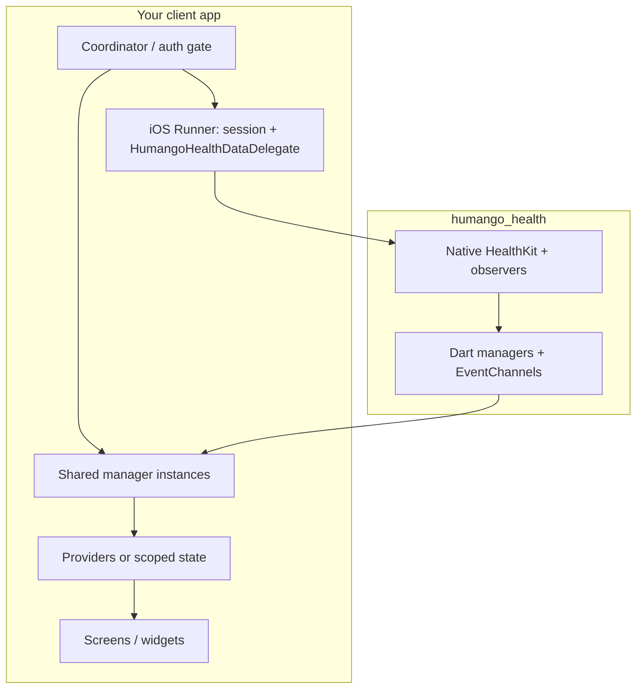

# Client app integration guide (consolidated)

Use this guide when wiring **any** Flutter host app to **`humango_health`**. It consolidates the [client integration contract](client_integration_contract.md) into actionable structure and steps.

| Document | Use when |
|----------|----------|
| **This guide** | Implementing or reviewing **your app’s** coordinator, providers, native bridge, and Dart streams |
| [client_integration_contract.md](client_integration_contract.md) | Semantics, envelopes, ordering, success criteria, and library vs client responsibilities |
| Subsystem docs (`activity_reading.md`, `sleep_data.md`, …) | Payloads and APIs **per domain** |

**Reference (this repo):** [README — User Session Management](../README.md#user-session-management) and [README — Delegate Delivery](../README.md#delegate-delivery). The example app uses **`ExampleSessionChannel`** / **`ExampleSessionManager`** (`com.humango.example/session`) plus **`HealthSyncCoordinator`**. Copy that **pattern** into production (your own channel names are fine).

---

## 1. What you are building

- **`humango_health`** reads HealthKit on the device. **Workouts**, **finalized sleep**, and **quantity-metric batches** (background/suspended) are pushed through **`HumangoHealthDataDelegate`** — the plugin does **not** POST to your API and does **not** maintain payload queues for those domains.
- **Your iOS Runner** sets **`UserAuthStateManager.shared.isLoggedIn`**, assigns **`HumangoHealthPlugin.delegate`**, and calls **`startAllBackgroundMonitoring()`** after login; **`logout()`** on sign-out.
- **Dart** uses MethodChannels for one-shot reads and for **`permissionStream`** / **`hrvUpdates`** where applicable.

---

## 2. Non‑negotiables (same in every client)

1. **Single orchestration for session + monitoring**  
   One module (e.g. `HealthSyncCoordinator`) should:
   - Call your **native session bridge** on login/logout (see `ExampleSessionChannel`).
   - Start **`startMonitoring`** / **`startHRVMonitoring`** (and any other monitors) from one place after auth — not from every screen.

2. **Delegate is mandatory for background “push” payloads**  
   If `HumangoHealthPlugin.delegate` is `nil`, auto-start skips and **delegate-only** deliveries (workouts, sleep nights, metric batches in background) are dropped. Set the delegate **before** `GeneratedPluginRegistrant` / plugin register completes if you rely on auto-start at launch.

3. **One stable subscription per Dart stream**  
   `permissionStream`, `hrvUpdates`: one listener per manager; cancel in `dispose`. There is **no** `workoutStream` in Dart — workout uploads are implemented in **`onWorkoutReady`** (Swift) or your own bridge.

4. **No timer‑based sync as primary path**  
   Prefer observers + **explicit** one-shot catch-up (`readWorkouts`, `getSleepData`, metric queries). **`getPendingHRVUpdates`** always returns **`[]`** — do not use it for recovery; use **`onHealthMetricSamplesReady`** for background metric batches.

5. **Uploads are host-owned**  
   While suspended, use **`URLSession`** (or similar) from the delegate implementation if you cannot wait for Dart.

---

## 3. Recommended app structure

| Piece | Responsibility |
|--------|----------------|
| **Runner session channel** | Set `isLoggedIn`, `delegate`, `startAllBackgroundMonitoring()` / `logout()` |
| **Coordinator** | Invokes session channel from Dart after auth; holds singleton `WorkoutReadManager` / `SleepDataManager` / `HealthMetricsManager` / `PermissionManager` |
| **Delegate handler (`HumangoHealthDataDelegate`)** | POST JSON for workouts, sleep, and metric batches; dedupe / retry |
| **Feature screens** | `readWorkouts`, `getSleepData`, toggles for monitoring; **do not** re-implement session setup per tab |

---

## 4. Implementation checklist

### Bootstrap

- [ ] Add `humango_health` dependency; see [contract § Local development](client_integration_contract.md#local-development-against-unpublished-library-changes) for `path:` / overrides.
- [ ] Implement **`HumangoHealthDataDelegate`** and register your **session** MethodChannel in the Runner.
- [ ] Provide a **coordinator** (or app service) that calls the session channel after login.

### Session (login / logout)

- [ ] **Login:** native sets `UserAuthStateManager.shared.isLoggedIn = true`, optional `userId`, `HumangoHealthPlugin.delegate = …`, `startAllBackgroundMonitoring()`.
- [ ] **Logout:** `HumangoHealthPlugin.shared?.logout()` (clears monitors and session flag inside native cleanup — see README).

### Monitoring & reads

- [ ] **Workouts:** `WorkoutReadManager.startMonitoring` / `readWorkouts` as needed; uploads in **`onWorkoutReady`**.
- [ ] **Sleep:** `SleepDataManager.startMonitoring` / `getSleepData`; uploads in **`onSleepSessionReady`**.
- [ ] **Metrics:** `HealthMetricsManager.startHRVMonitoring()`; **`hrvUpdates`** while foreground; **`onHealthMetricSamplesReady`** for background batches.
- [ ] **Permissions:** single `permissionStream` subscription at app shell.

### UI performance

- [ ] Narrow **`Selector`** / **`select`** so health events do not rebuild entire trees.

### Testing

- [ ] Mock Dart streams; for delegate behavior, XCTest or integration tests against your Runner handler.

---

## 5. Mapping concerns to docs

| Concern | Where to read |
|---------|----------------|
| Session + delegate | [README](../README.md#user-session-management), [Delegate Delivery](../README.md#delegate-delivery) |
| Workout read / monitor | [README — Workout Reading](../README.md#workout-reading--monitoring), [activity_reading.md](activity_reading.md) |
| Sleep | [README — Sleep](../README.md#sleep-data-reading--monitoring), [sleep_data.md](sleep_data.md) |
| Metrics / HRV | [README — HRV / metrics](../README.md#hrv-automatic-updates-background--suspended) |

---

## 6. Anti‑patterns

| Don’t | Do instead |
|-------|------------|
| Expect `workoutStream` or `configureBackgroundDelivery` | Use delegate + MethodChannel reads (removed in 0.0.14–0.0.15) |
| Rely on `getLocalSleepSessions` or sleep `UserDefaults` queues | Implement `onSleepSessionReady` |
| Poll `getPendingHRVUpdates` | Implement `onHealthMetricSamplesReady` |
| Call session setup from every tab | Coordinator / single native entry |

---

## 7. Aligning versions in another repo

- Pin **`humango_health`** in `pubspec.yaml`.
- Refresh vendored copies of this guide and the [contract](client_integration_contract.md) when bumping the package.

---

## 8. Related links

- [README — Consumer app integration](../README.md#consumer-app-integration)
- [CHANGELOG](../CHANGELOG.md)
