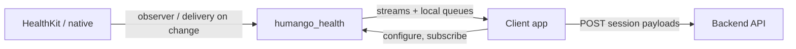

# Client app integration contract: push-on-update (library) vs capture (client)

## Where this file lives

- **Canonical:** This contract lives in the **humango_health** repository as [`docs/client_integration_contract.md`](client_integration_contract.md) (this file).
- **Consumer apps:** Apps that depend on the published or Git-pinned package may **keep a copy** of this document (or a short app-specific supplement) aligned with the **pinned `humango_health` version**; refresh when bumping the dependency or when stream APIs change.

### Local development against unpublished library changes

**Git dependencies** do not see uncommitted changes in a clone. To exercise client code against local plugin edits:

- Use a **`path:`** dependency on this plugin’s root directory (same directory as its [`pubspec.yaml`](../pubspec.yaml)) or a **`dependency_overrides`** entry pointing at your local `humango_health` checkout until changes are pushed and the app pins a new `ref:`.

See also: **[Client app integration guide](client_app_integration_guide.md)** (implementation steps).

---

This document defines the **integration contract** between **`humango_health`** (this Flutter plugin) and **consumer apps** (e.g. a host app that embeds the plugin). Use it as a checklist when wiring the client and when changing stream APIs in the library.

The library is intended to be **self-contained** on iOS: it **fetches** HealthKit data from the device and **pushes** updates to **subscribed** clients; the app wires credentials, configuration, and UI—it does not replace the library as the HealthKit reader for covered domains.

---

## Principles

| Role | Responsibility |
|------|----------------|
| **Library (`humango_health`)** | **Owns** HealthKit reads on the device via native queries and observers. **Dart:** MethodChannels + small set of EventChannels (`permissionStream`, `hrvUpdates`). **Runner:** **`HumangoHealthDataDelegate`** for completed workouts, finalized sleep, and quantity-metric batches when Flutter is not in foreground. **Emits when there is a real update** (or when a one-shot API completes). |
| **Client app** | **One** delegate implementation for upload/dedup; **stable** Dart stream subscriptions where they exist; **does not** use periodic polling as the primary sync for observer-driven data. |

**Workouts** and **finalized sleep sessions** are delivered only via **`HumangoHealthDataDelegate`** in your iOS Runner (no Dart `workoutStream`, no plugin-owned `UserDefaults` payload queues). **Quantity-metric** batches use the same delegate when the app is backgrounded or suspended; the foreground **`hrvUpdates`** stream mirrors batches for Dart. The plugin **does not** POST health payloads to your API.

---

## High-level flow



---

## Gaps to be aware of (library today)

- **No single “envelope contract” implemented uniformly in code yet** — there may be **no** `envelope` matches in the plugin’s markdown until docs are expanded. Treat the **recommended** envelope below as a **target**, not “already true for every stream.”
- **Subsystem docs are the source of truth for now** — in this repo, files such as [`activity_reading.md`](activity_reading.md), [`sleep_data.md`](sleep_data.md), and [`permissions_management.md`](permissions_management.md) are the natural place for payload and behavior **per domain** until one consolidated contract exists for every channel.
- **Coalescing / dedupe is domain-specific** — e.g. workout dedupe may live in native workout stores and UI bridge code; **sleep**, **metrics/HRV**, and **permissions** can follow different rules. There is **not** necessarily one unified `HealthLibraryStreamEvent`-style envelope across **all** domains yet—verify each stream’s doc and Dart API.

---

## Event envelope (recommended)

Client code should not infer intent from ambiguous raw JSON. When the library adopts a unified shape, use:

```json
{
  "schemaVersion": 1,
  "type": "workout_added",
  "id": "<stable-id>",
  "payload": {}
}
```

- **`schemaVersion`**: Increment when payload or semantics change; client can branch or reject unknown versions.
- **`type`**: Examples: `workout_added`, `workout_updated`, `permission_changed`, `sleep_session_finalized`, `background_upload_succeeded`, `background_upload_failed` (only if exposed to Dart).
- **`id`**: Stable identifier for deduplication (e.g. HealthKit workout UUID).

Until all channels use this envelope, document each existing stream’s payload in library docs and treat parsing as **version-specific**.

---

## Semantics the client should assume

### Ordering and gaps

- **Cross-domain ordering** (e.g. workout vs sleep vs permission) is **not guaranteed**.
- For a **single** `id`, the library should document whether events are strictly ordered (e.g. `workout_updated` after `workout_added`) or **best effort**.
- If the Dart engine is not running, **events may not be delivered**. Recovery is via **explicit** one-shot APIs (e.g. refresh since a cursor, fetch stored sessions), **not** a periodic timer.

### Cold start and catch-up

- **On subscribe:** Document whether the library emits **only future changes** or also a **snapshot / catch-up** for known state.
- **After process death:** Document the supported **reconciliation** path (`readWorkouts`, `getSleepData`, one-shot metrics queries, etc.). Background metric batches and completed workouts/sleep rely on **native delegate delivery** when iOS relaunches the app — `getPendingHRVUpdates` is not a recovery path (it returns an empty list). Prefer **user-triggered** refresh when Dart was not running.

### Idempotency

- Client handlers should treat emissions as **idempotent**: same `(type, id)` or `(id, revision)` should not corrupt local state if processed twice.

---

## Library responsibilities (checklist for `humango_health`)

### 1. Document stream contracts

For each public `Stream` / `EventChannel` surface:

- **When events are emitted** (new/updated entity, observer callback, background task finished).
- **When nothing is emitted** (idle store, no HealthKit change).
- **Threading / isolate**: Typically delivery on the **Dart main isolate** after platform marshaling; state explicitly in each stream’s doc.
- **Payload format** (JSON examples or schema).

### 2. Push-only from native observers

- Prefer HealthKit observer queries and system background delivery so Dart receives events **because data changed**, not on a fixed timer.
- Remove or gate any **timer-based** emission that duplicates observer-driven updates (product-specific timers, e.g. sleep re-check windows, should be documented as **native internal** behavior, not a substitute for client polling).

### 3. Coalesce and deduplicate

- **Coalesce** rapid successive updates for the same logical entity where appropriate.
- **Dedupe** by stable identifiers so the client does not see the same update repeatedly.

Optional: configuration (debounce window, strict dedupe on/off) for different app tradeoffs.

### 4. Foreground stream vs delegate delivery

| Path | Purpose |
|------|---------|
| **Workouts** | **`HumangoHealthDataDelegate.onWorkoutReady`** when monitoring detects a completed workout. One-shot history remains **`readWorkouts`** / **`fetchAllWorkouts`** on the MethodChannel. **No** plugin HTTP. |
| **Sleep** | **`HumangoHealthDataDelegate.onSleepSessionReady`** when a night is finalized. One-shot **`getSleepData`** / **`calculateSleepPayload`** remain on the MethodChannel. |
| **Quantity metrics** | **`hrvUpdates`** EventChannel while **foreground**; **`onHealthMetricSamplesReady`** when not (delegate required). |

Host upload outcomes (HTTP success/failure) are **entirely app-owned** — the library does not emit “upload succeeded” events.

### 5. Configuration idempotency

- Calls such as **`startHRVMonitoring`** should be **safe to repeat** (native code should not stack duplicate observers). Session wiring (**`isLoggedIn`**, **`delegate`**) is host-owned and should be idempotent where your app retries login.

### 6. Testing in the library

- Unit / integration tests for dedupe, coalescing, and envelope parsing (fixtures in Dart where possible; native tests for observer behavior).
- Where testable, verify **no events** when the store is idle.

---

## Client app responsibilities (checklist)

### 1. Single orchestration for session + monitoring

- One module (e.g. `HealthSyncCoordinator`) runs after **auth + athlete id** (and token) are available.
- Invokes your **native** session bridge **once** (login → `isLoggedIn`, `delegate`, `startAllBackgroundMonitoring()`; logout → `logout()`).
- Starts Dart-side monitoring (`startWorkoutMonitoring`, `startSleepMonitoring`, `startHRVMonitoring`) from one place — not scattered across unrelated widgets.

### 2. Stable subscriptions / single delegate handler

- For each Dart **`Stream`** (`permissionStream`, `hrvUpdates`, …): one listener per manager; **cancel** in `dispose` / when monitoring stops.
- **Workouts** and **sleep** completions: implement **`HumangoHealthDataDelegate`** once in the Runner; avoid duplicate side effects across multiple delegate objects.

### 3. No polling as primary sync

- Do not use a timer to re-fetch the same data the library already observes.
- Use **explicit** user or lifecycle triggers (pull-to-refresh, post-login) if calling one-shot APIs such as `readWorkouts`, `getSleepData`, or metric fetches.

### 4. Adapt to the envelope

- Parse `schemaVersion`, `type`, and `id`.
- Update providers and UI **incrementally** where possible instead of full reloads.

### 5. Client tests

- Mock stream emissions and assert provider state (and critical UI).
- Optionally one integration test: configure → emit → state.

---

## Success criteria (both sides)

1. With the app in the foreground and **no** HealthKit changes, the **UI-facing stream** does not emit spurious events.
2. After a real change, the client receives **one coherent event** (or a **short, documented** sequence), not an unbounded repeat of the same payload.
3. Background API upload behavior remains **defined and documented separately** from the UI stream.

---

## Platform realities (document for support / QA)

- HealthKit may **coalesce** updates; one callback may represent multiple writes.
- **Foreground observer** and **background delivery** may both run; the library should **dedupe before Dart** where both paths feed the same logical stream.
- **Permission** events are not the same as **data** events; keep types distinct in the envelope.

---

## Related documentation

### In `humango_health` (this repository — maintain alongside this contract)

| Document | Topic |
|----------|--------|
| [`activity_reading.md`](activity_reading.md) | Workout reading and streams |
| [`sleep_data.md`](sleep_data.md) | Sleep monitoring and delivery modes |
| [`permissions_management.md`](permissions_management.md) | Permission streams and background setup |
| [`README.md`](../README.md) | Overview, consumer integration summary, background delivery notes |

### In consumer apps

- App-specific integration guides (coordinator touchpoints, QA checklists) live **in the app repository**. When the library changes event shapes or adds streams, **update subsystem docs and this contract** in `humango_health`, **bump the package version**, and adjust the client’s vendored copy or pinned Git `ref:` as needed.
